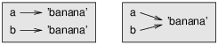
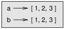
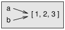

# Objects
## String Objects
If we run these assignment statements:

``` python
a = 'banana'
b = 'banana'
```

We know that a and b both refer to a string, but we don’t know whether they refer to the same string. There are two possible states, shown below.



In one case, `a` and `b` refer to two different objects that have the same value. In the second case, they refer to the same object.

To check whether two variables refer to the same object, you can use the `is` operator.

``` python
a is b # true
```
In this example, Python only created one string object, and both a and b refer to it. Thus, the diagram on the right is the correct state diagram.

## List Objects

When you create two lists, you get two *different* objects. Look at the lists below. We would say that the two lists are *equivalent*, because they have the same elements, but not *identical*, because they are not the same object. If two objects are identical, they are also equivalent, but if they are equivalent, they are not necessarily identical.


``` python
a = [1, 2, 3]
b = [1, 2, 3]

# Equivalence does not imply identicality
a == b # True
a is b # False
```

That means that the state diagram looks similar to the one of the left. 



If `a` refers to an object and you assign `b = a`, then both variables refer to the same object:

``` python
a = [1, 2, 3]
b = a
b is a # True
```

The state diagram looks like this:



The association of a variable with an object is called a *reference*. In this example, there are two references to the same object. An object with more than one reference has more than one name, so we say that the object is aliased. 

## String Methods

Strings are **immutable**. That means that they cannot be changed at a later time. Below, we created a string *object*. We can only read it; we can't change its properties.

``` python
"Ronan"
```

Of course, we can still assign and reaassign different string objects to a variable.

``` python
# Var officer reassigned to a different onbject
officer = "Ronan" 
officer = "Ethan" 
```

String methods return a different value.

``` python
word = 'banana'
new_word = word.upper() 
print(new_word) # BANANA
```

Note that string methods can't change the string in-place. If there is a variable that refers to a string object `x`, it will be unchanged after a string method is used, since `x` itself has not changed.

``` python
word = 'banana'
word.upper() # Apply string method
print(word) # Word is unchanged ('banana')
```

## List Methods

Unlike strings, lists are mutable. We can change its values. Let's compare string methods to list methods. While string methods return a different object, most list methods return `None`.

``` python
lst = [1, 2, 3]
print(lst.append(4)) # None
```

That is because the methods modify the list object in-place.

```python
lst = [1, 2, 3]
lst.append(4) 
print(lst) # [1, 2, 3, 4]
```